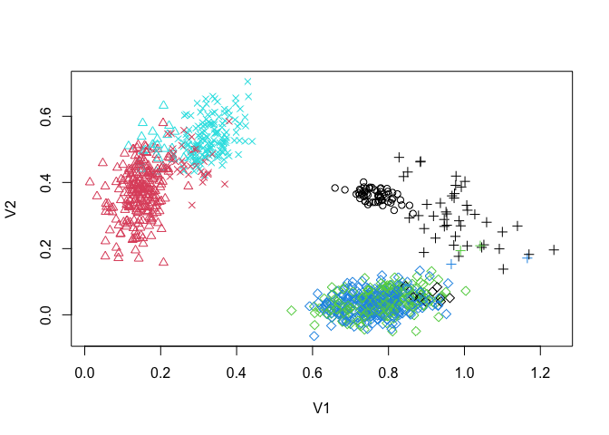

<!-- README.md is generated from README.Rmd. Please edit that file -->

[](https://cran.r-project.org/package=SAGMM)
[](https://travis-ci.org/andrewthomasjones/SAGMM)

# SAGMM

The SAGMM package allows for computation of gaussian mixture models
using stochastic approximation to increase efficiency with large data
sets. The primary function  allows this to be performed in a relative
flexible manner.

## Installation

You can install SAGMM from github with:

``` r
# install.packages("devtools")
devtools::install_github("andrewthomasjones/SAGMM")
```

## Example

This is a basic example which shows you how to solve a common problem:

``` r
library(SAGMM)
#generate sample data
sims<-generateSimData(ngroups=10, Dimensions=10, Number=10^5)

#time fit
ptm <- proc.time()
res1<-SAGMMFit(sims$X, ngroups=10)
#> Warning: did not converge in 10 iterations
#> Warning: Quick-TRANSfer stage steps exceeded maximum (= 5000000)
proc.time()-ptm #should be under 15 seconds for 10 x 10^5 dataset on an ordinary laptop
#>    user  system elapsed 
#>  15.623   0.338  19.157
```

``` r
library(SAGMM)
#generate sample data
sims<-generateSimData(ngroups=5, Dimensions=2, Number=10^3)
#plot
res2<-SAGMMFit(sims$X, sims$Y, plot=T)
```

<!-- -->

## Authorship statement

The `SAGMM` package is co-authored by [Andrew T.
Jones](https://github.com/andrewthomasjones) and [Hien D.
Nguyen](https://github.com/hiendn).

## Bug reporting and contributions

Thank you for your interest in `SAGMM`. If you happen to find any bugs
in the program, then please report them on the Issues page
(<https://github.com/andrewthomasjones/SAGMM/issues>). Support can also
be sought on this page. Furthermore, if you would like to make a
contribution to the software, then please forward a pull request to the
owner of the repository.
